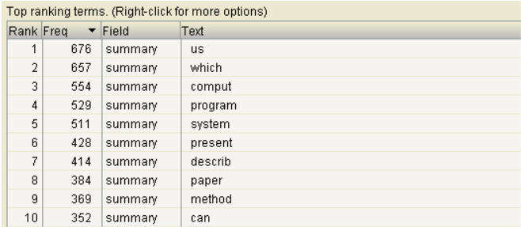
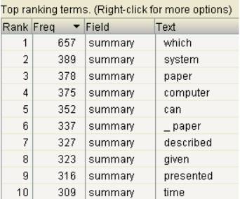
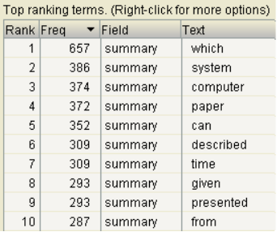
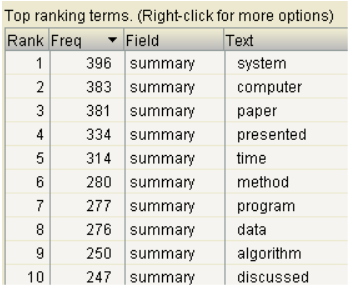

# <center>Indexing and Search with Apache Lucene</center>
### <center>Lab N°1</center>
#### <center>Xavier Vaz Afonso & Joël Kaufmann</center>

### Understanding the Lucene API

##### *Does the command line demo use stopword removal? Explain how you find out the answer.*</br>
Oui, on observe à la ligne 98 de `SearchFiles.java` qu’un `StandardAnalyser` est utilisé et celui-ci utilise une liste de stopwords.

``` java
List<String> stopWords = Arrays.asList("a", "an", "and", "are", "as", "at", "be", "but", "by", "for", "if", "in", "into", "is", "it", "no", "not", "of", "on", "or", "such", "that", "the", "their", "then", "there", "these", "they", "this", "to", "was", "will", "with");
```

On le voit en lançant une recherche : </br>
```
Enter query: The Lord of the Rings
Searching for: lord rings
```

##### *Does the command line demo use stemming? Explain how you find out the answer.*</br>
Non, il utilise un `StandardAnalyzer`, qui ne possède pas de mécanisme de stemming. Il faudrait utiliser un `EnglishAnalyser` par exemple.
En reprenant l’exemple donné dans le cours, on en a confirmation :

```
Searching for: organizes -> 1 total matching documents
Searching for: organize -> 0 total matching documents
```

##### *Is the search of the command line demo case insensitive? How did you find out the answer?*</br>
Non, le `QueryParser.parse(String)` remplace notamment les majuscules.
Confirmé dans la requête suivante :
```
Enter query: The Lord of the Rings
Searching for: lord rings
```

##### *Does it matter whether stemming occurs before or after stopword removal? Consider this as a general question.*
Oui, il faut considérer les stopwords comme des mots qu’on souhaite ignorer.
Ainsi d’une part, en faisant l’opération de stemming avant, on va tenter d’opérer ce stemming sur ces mots, ce qui va nécessiter des ressources inutiles.
D’autre part si le stemming change le mot, il ne sera alors plus reconnu comme mot à supprimer lors de la phase de suppression des stopwords et empêchera le bon déroulement.
</br></br>

#### Indexing

##### Choix des types des Fields

*id* : `LongPoint` convient au type `long` d’id, on ajoutera aussi un `StoredField` pour le stocker et pouvoir l'utiliser dans les recherches.

*author* : On utilisera un `StringField` pour pouvoir afficher les noms des auteurs complets pour une statistique de fréquence. Mais  le champ auteur est défini avec une/des abréviation du/des prénoms et son nom, pas toujours du même format d’un livre à l’autre. Pour une recherche, on préférera utiliser un `TextString` qui va permettre de tokeniser tous les termes, quitte à avoir l'abbréviation d'un prénom en terme le plus fréquent.

*title* : `TextField`, pour pouvoir obtenir un titre d’après un ou plusieurs termes.

*summary* : Ici, aucun doute, on souhaite indexer tout le contenu terme à terme avec un `TextField`.


##### What should be added to the code to have access to the term vector in the index? Have a look at the Lucene slides presented in your course (look at different methods of FieldType). Use Luke to check that the term vector is included in the index.

Il faut utiliser un `FieldType` et utiliser les méthodes `setStoreTermVectors`, `setStoreTermVectorOffsets` et `setStoreTermVectorPositions` avec le paramètre à `true`.

``` Java
FieldType fieldType = new FieldType();
fieldType.setIndexOptions(IndexOptions.DOCS);
fieldType.setTokenized(true);
fieldType.setStored(true);
fieldType.setStoreTermVectors(true);
fieldType.setStoreTermVectorOffsets(true);
fieldType.setStoreTermVectorPositions(true);
fieldType.freeze();

Field fieldId = new LongPoint("id", id);
StoredField storedId = new StoredField("id", id);

String[] authorsArray = authors.split(";"); // authors might be "author1; author2; ..."
for (String authorName : authorsArray) {
  Field author = new Field("authors", authorName, fieldType);
  doc.add(author);
}

Field fieldTitle = new Field("title", title, fieldType);
Field fieldSummary = new Field("summary", summary, fieldType);

doc.add(fieldId);
doc.add(storedId);
doc.add(fieldTitle);
doc.add(fieldSummary);
```
</br>

#### Using different Analyzers
Nous avons utilisé la classe `ClassicSimilarity` pour tout le projet, sauf pour la dernière question qui demande de comparer la requête “compiler program” avec `ClassicSimilarity` et la nouvelle version basée sur TF-IDF expliqué dans la section "Tuning the Lucene Score".

##### indexed documents
Tous les analyseurs indexent le même nombre de document, i.e le nombre de lignes de notre fichier, à savoir 3203.

| Analyzer                        | Indexed terms |
|:--------------------------------|--------------:|
| WhitespaceAnalyzer              |        34'443 |
| EnglishAnalyzer                 |        22'513 |
| ShingleAnalyzerWrapper (size 2) |       105'802 |
| ShingleAnalyzerWrapper (size 3) |       147'205 |
| StopAnalyzer                    |        24'025 |


| Analyzer                        | indexed terms in summary field |
|:--------------------------------|--------------:|
| WhitespaceAnalyzer              |        26’821 |
| EnglishAnalyzer                 |        16’724 |
| ShingleAnalyzerWrapper (size 2) |        85’610 |
| ShingleAnalyzerWrapper (size 3) |       125’776 |
| StopAnalyzer                    |        18’342 |

##### Top 10 frequent terms of the summary field in the index

WhitespaceAnalyzer</br>


EnglishAnalyzer</br>


ShingleAnalyzerWrapper size=2</br>


ShingleAnalyzerWrapper size=3</br>


StopAnalyzer</br>


| Analyzer                        | Size on the disk|
|:--------------------------------|----------------:|
| WhitespaceAnalyzer              |        1.599 Mo |
| EnglishAnalyzer                 |        1.344 Mo |
| ShingleAnalyzerWrapper (size 2) |        2.998 Mo |
| ShingleAnalyzerWrapper (size 3) |        4.105 Mo |
| StopAnalyzer                    |        1.342 Mo |

| Analyzer                        | Required time for indexing\*|
|:--------------------------------|----------------:|
| WhitespaceAnalyzer              |1968ms(min) 2355ms(max) 2209.4ms(avg) 2207.5ms(med) |
| EnglishAnalyzer                 |2154ms(min) 2536ms(max) 2342.4ms(avg) 2290ms(med) |
| ShingleAnalyzerWrapper (size 2) |3199ms(min) 4116ms(max) 3803.7ms(avg) 3861.5ms(med) |
| ShingleAnalyzerWrapper (size 3) |2021ms(min) 4825ms(max) 4426.2ms(avg) 4420ms(med) |
| StopAnalyzer                    |1993ms(min) 2410ms(max) 2154.7ms(avg) 2136ms(med) |
\*Basé sur 10 exécutions indépendantes, comprend la lecture du fichier (qui devrait être la même pour tous les analyseurs), dans le même environnement et dans des conditions similaires.


#### Reading Index
Utilisation d'un `StandardAnalyzer` avec `ClassicSimilarity`.
##### *1. What is the author with the highest number of publications? How many publications does he/she have?*
```
Top ranking terms for field [authors] are:
 : 84
Thacher Jr., H. C. : 38
Naur, P. : 19
Hill, I. D. : 16
Wirth, N. : 15
Pike, M. C. : 14
Herndon, J. R. : 14
Gautschi, W. : 14
Boothroyd, J. : 14
George, R. : 12
```
Il y a plus de livres ayant un auteur inconnu mais l’auteur qui a le nombre de publications le plus élevé est Thacher Jr., H. C.

Cependant, comme nous utilisons un `StringField` pour le champ de l'auteur, il va tokeniser le nom en entier. Le champ devra donc être identique pour pouvoir être compté correctement. Thacher Jr., H. C. apparait réellement 41 fois dans le fichier cacm.txt mais avec quelques formes légèrement différentes. Par exemple à la ligne 735, avec un espace en moins. Certains auteurs seront donc sous-évalués.

Une solution serait d'utiliser un `Textfield` pour pouvoir créer plusieurs tokens pour un auteur malheureusement avec cette approche, les initiales seront tockenisées et deviendraient les meilleures réponses. De plus, si des auteurs partagent le même nom de famille ou prénom cette solution ne peut pas marcher. Ce qu'on constate avec **Smith** dans le résultats suivant (dont on a enlevé les initiales de prénoms)

```
Top ranking terms for field [authors] are: 

smith : 43
thacher : 41
hill : 23
naur : 19
herndon : 18
wirth : 16
brown : 15
pike : 14
graham : 14
gautschi : 14
```


##### *2. List the top 10 terms in the title field with their frequency.*
```
Top ranking terms for field [title] are
algorithm : 1008
comput : 392
program : 307
system : 280
gener : 169
method : 156
languag : 144
function : 142
us : 123
data : 110
```

``` java
public void printTopRankingTerms(String field, int numTerms) {

   System.out.println("Top ranking terms for field ["  + field +"] are: ");

      HighFreqTerms.DocFreqComparator cmp = new HighFreqTerms.DocFreqComparator();

      try {
          TermStats[] highFreqTerms = HighFreqTerms.getHighFreqTerms(indexReader,numTerms,field,cmp);

          for (TermStats ts : highFreqTerms) {
              System.out.println(ts.termtext.utf8ToString() + " : " + ts.docFreq);
          }

      } catch (Exception e) {
          e.printStackTrace();
      }
  }

public void query(String q) {

      System.out.println("Searching for [" + q +"]");

      Query query = null;

      QueryParser parser = new QueryParser("summary",analyzer);

      try {
          query = parser.parse(q);
          System.out.println("text of the query : " + query);
      } catch (ParseException e) {
          e.printStackTrace();
      }

      try {
          ScoreDoc[] hits = indexSearcher.search(query,10).scoreDocs;

          int nb = indexSearcher.count(query);

          System.out.println("text of the query : " + nb);

          for(ScoreDoc hit : hits){
              Document doc = indexSearcher.doc(hit.doc);
              System.out.println((doc.get("id") + ": " + doc.get("title") + " (" + hit.score + ")"));
          }

      } catch (IOException e) {
          e.printStackTrace();
      }
  }
```
#### Searching
##### 1. Publications containing the term "Information Retrieval".
```
Searching for [Information Retrieval]
text of the query : summary:inform summary:retriev
total number of results : 188

1457: Data Manipulation and Programming Problemsin Automatic Information Retrieval (1.180699)
891: Everyman's Information Retrieval System (1.1004101)
1935: Randomized Binary Search Technique (1.0225154)
1699: Experimental Evaluation of InformationRetrieval Through a Teletypewriter (0.9628588)
3134: The Use of Normal Multiplication Tablesfor Information Storage and Retrieval (0.9191686)
2307: Dynamic Document Processing (0.913785)
1032: Theoretical Considerations in Information Retrieval Systems (0.8855243)
1681: Easy English,a Language for InformationRetrieval Through a Remote Typewriter Console (0.87130356)
2990: Effective Information Retrieval Using Term Accuracy (0.87130356)
2519: On the Problem of Communicating Complex Information (0.7863115)
```
##### 2. Publications containing both "Information" and "Retrieval".
```
Searching for [Information AND Retrieval]
text of the query : +summary:inform +summary:retriev
total number of results : 23
1457: Data Manipulation and Programming Problemsin Automatic Information Retrieval (1.180699)
891: Everyman's Information Retrieval System (1.1004101)
1935: Randomized Binary Search Technique (1.0225154)
1699: Experimental Evaluation of InformationRetrieval Through a Teletypewriter (0.9628588)
3134: The Use of Normal Multiplication Tablesfor Information Storage and Retrieval (0.9191686)
2307: Dynamic Document Processing (0.913785)
1032: Theoretical Considerations in Information Retrieval Systems (0.8855243)
1681: Easy English,a Language for InformationRetrieval Through a Remote Typewriter Console (0.87130356)
2990: Effective Information Retrieval Using Term Accuracy (0.87130356)
2519: On the Problem of Communicating Complex Information (0.7863115)
```

##### 3. Publications containing at least the term "Retrieval" and, possibly "Information" but not "Database".
```
Searching for [+Retrieval information -Database]
text of the query : +summary:retriev summary:inform -summary:databas
total number of results : 54

1457: Data Manipulation and Programming Problemsin Automatic Information Retrieval (1.180699)
891: Everyman's Information Retrieval System (1.1004101)
1935: Randomized Binary Search Technique (1.0225154)
1699: Experimental Evaluation of InformationRetrieval Through a Teletypewriter (0.9628588)
3134: The Use of Normal Multiplication Tablesfor Information Storage and Retrieval (0.9191686)
2307: Dynamic Document Processing (0.913785)
1032: Theoretical Considerations in Information Retrieval Systems (0.8855243)
1681: Easy English,a Language for InformationRetrieval Through a Remote Typewriter Console (0.87130356)
2990: Effective Information Retrieval Using Term Accuracy (0.87130356)
2519: On the Problem of Communicating Complex Information (0.7863115)
```

##### 4. Publications containing a term starting with "Info".
```
Searching for [Info*]
text of the query : summary:info*
total number of results : 193

222: Coding Isomorphisms (1.0)
272: A Storage Allocation Scheme for ALGOL 60 (1.0)
396: Automation of Program  Debugging (1.0)
397: A Card Format for Reference Files in Information Processing (1.0)
409: CL-1, An Environment for a Compiler (1.0)
440: Record Linkage (1.0)
483: On the Nonexistence of a Phrase Structure Grammar for ALGOL 60 (1.0)
616: An Information Algebra - Phase I Report-LanguageStructure Group of the CODASYL Development Committee (1.0)
644: A String Language for Symbol Manipulation Based on ALGOL 60 (1.0)
655: COMIT as an IR Language (1.0)
```

##### 5. Publications containing the term "Information" close to "Retrieval" (max distance 5).
```
Searching for ['Information Retrieval'~5]
text of the query : summary:inform summary:retrieval'~2
total number of results : 159
2160: Canonical Structure in Attribute Based File Organization (0.471206)
2832: Faster Retrieval from Context Trees (Corrigendum) (0.2385921)
2905: Perfect Hashing Functions: A SingleProbe Retrieving Method for Static Sets (0.15906142)
1746: Protection in an Information Processing Utility (0.15630794)
1976: Multi-attribute Retrieval with Combined Indexes (0.13255118)
1516: Automatic Data Compression (0.11844581)
1251: American Standard and IFIP/ICC Vocabularies compared (0.110526405)
1267: Performance of Systems Used for Data TransmissionTransfer Rate of Information Bits -An ASA TutorialStandard (0.110526405)
1332: Subroutine Assembly (0.110526405)
2870: A Lattice Model of Secure Information Flow (0.108125746)
```

#### Tuning the Lucene Score

##### *Compute the query compiler program with the ClassicSimilarity and new similarity function using the above parameters and show the ClassicSimilarity and new rankings/scores for top 10 publications. Describe the effect of using the new parameters.*

Si on se base sur la requête dont les publications contiennent les termes “compiler program” dans leur sommaire avec `ClassicSimilarity`, on obtient :

```
Searching for [compiler program]
text of the query : summary:compil summary:program
total number of results : 578

3189: An Algebraic Compiler for the FORTRAN Assembly Program (1.0367663)
1459: Requirements for Real-Time Languages (0.9427518)
2652: Reduction of Compilation Costs Through Language Contraction (0.93779767)
1183: A Note on the Use of a Digital Computerfor Doing Tedious Algebra and Programming (0.8799802)
1465: Program Translation Viewed as a General Data Processing Problem (0.82941306)
1988: A Formalism for Translator Interactions (0.82941306)
1647: WATFOR-The University of Waterloo FORTRAN IV Compiler (0.8082413)
1237: Conversion of Decision Tables To Computer Programs (0.7542014)
2944: Shifting Garbage Collection Overhead to Compile Time (0.7542014)
637: A NELIAC-Generated 7090-1401 Compiler (0.74336267)
```

Avec le nouveau score :
```
Searching for [compiler program]
text of the query : summary:compil summary:program
total number of results : 578

2534: Design and Implementation of a Diagnostic Compiler for PL/I (7.411339)
637: A NELIAC-Generated 7090-1401 Compiler (6.836161)
2652: Reduction of Compilation Costs Through Language Contraction (6.555643)
2923: High-Level Data Flow Analysis (6.465453)
1647: WATFOR-The University of Waterloo FORTRAN IV Compiler (6.258721)
1465: Program Translation Viewed as a General Data Processing Problem (5.8141103)
1988: A Formalism for Translator Interactions (5.8141103)
3189: An Algebraic Compiler for the FORTRAN Assembly Program (5.8141103)
1135: A General Business-Oriented Language Based on Decision Expressions* (5.0494967)
1237: Conversion of Decision Tables To Computer Programs (5.0494967)
```
On obtient le même nombre de résultats en total ce qui est normal. Les poids changent donc l'ordre aussi mais les résultats restent assez similaires. On obtient 7 résultats sur 10 identiques à la première recherche.

Les ids des documents sont : 637, 2652, 1647, 1465, 1988, 3189, 1237

```java
public class MySimilarity extends ClassicSimilarity {

   public float tf(float freq){

       float result = (float) (1 + Math.log(freq));
       return result;
   }

   public float idf(long docFreq, long numDocs){

       float result = (float) (Math.log(numDocs/(docFreq+1))+1);
       return result;
   }

   public float coord(int overlap,int maxOverlap){

       float result = (float) Math.sqrt(overlap/maxOverlap);
       return result;
   }

   public float lengthNorm(FieldInvertState state){
       return 1f;
   }
}
```
